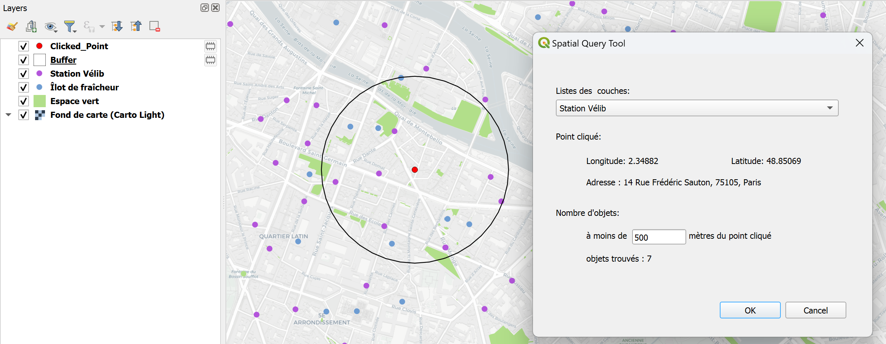

# **Spatial Query Tool**
🔍 **Un plugin QGIS pour l'interaction avec les couches vectorielles et l'analyse spatiale**  

## **📖 Description**
Spatial Query Tool est un plugin pour QGIS permettant aux utilisateurs d’interagir avec des couches vectorielles ponctuelles, d’obtenir des informations sur des points cliqués et de réaliser des analyses spatiales simples.  

🚀 **Fonctionnalités principales** :  
✔️ Sélectionner une couche vectorielle contenant uniquement des géométries ponctuelles.  
✔️ Obtenir les coordonnées exactes d'un point cliqué (EPSG:4326).  
✔️ Trouver l’adresse postale la plus proche en utilisant l’API BAN (Base Adresse Nationale).  
✔️ Compter le nombre d'objets situés dans un rayon X mètres autour du point cliqué.  
✔️ Visualiser le point cliqué (en rouge) et la zone tampon (contour noir, sans remplissage).  


## **📥 Installation**
### **1️⃣ Installation depuis le dépôt GitHub**
1. Cloner ce dépôt :  
   ```bash
   git clone https://github.com/lin0qlin/Qplugin_SpatialQueryTool.git
   ```
2. Copier le dossier dans le répertoire des plugins QGIS :  
   ```bash
   cp -r spatial_query_tool/ C:/Users/username/AppData/Roaming/QGIS/QGIS3/profiles/default/python/plugins/
   ```
3. Ouvrir QGIS et activer le plugin dans **Gestionnaire des extensions**.  


## **🎯 Comment utiliser ?**
1. Ouvrir le plugin depuis le menu **Extensions > Spatial Query Tool**.  
2. Sélectionner une couche vectorielle contenant des points.  
3. Entrer une distance (en mètres).
4. Cliquer sur la carte pour obtenir :  
   - Les coordonnées en EPSG:4326.  
   - L’adresse la plus proche.  
   - Le nombre d’objets dans la zone tampon.  
   - Une visualisation du point et du buffer sur la carte.




## **🛠 Technologies utilisées**
- **QGIS 3.x**
- **PyQGIS**
- **Qt Designer**
- **API GéoPlateforme (BAN)**
- **Python 3.x**